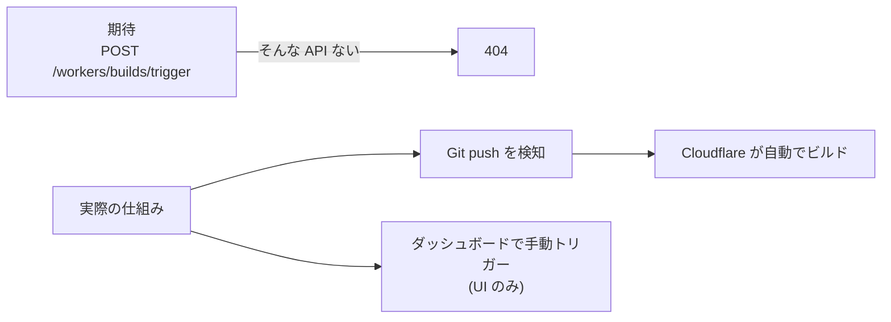

[Astro](https://astro.build/) + [Cloudflare Workers](https://developers.cloudflare.com/workers/) で<Moji emoji="ランディング" /><Moji emoji="ページ" />を<Moji emoji="自動" /><Moji emoji="デプロイ" />する Claude Code <Moji emoji="スキル" />——`launch-site`——を<Moji emoji="作り" />ました。<Moji emoji="作り" />終えてみると、5つの<Moji emoji="罠" />を踏んでいました。<Moji emoji="ドキュメント" />に<Moji emoji="書いて" />いない<Moji emoji="罠" />、<Moji emoji="思い込み" />の<Moji emoji="罠" />、「それ<Moji emoji="仕様" />ですか」という<Moji emoji="罠" />。<Moji emoji="手元" />で<Moji emoji="確かめ" />た<Moji emoji="順" />に<Moji emoji="書き" />ます。

---

## 1つめ: Workers Builds にトリガー API はない

最初、こう<Moji emoji="考え" />ていました——Workers Builds の<Moji emoji="トリガー" />を REST API で<Moji emoji="叩けば" />、`push` 後に<Moji emoji="自動" /><Moji emoji="デプロイ" />が<Moji emoji="完了" />する、と。

[Cloudflare の API リファレンス](https://developers.cloudflare.com/api/)を<Moji emoji="探し" />ました。<Moji emoji="見つかり" />ませんでした。GitHub Actions<Moji emoji="経由" />ならあります。<Moji emoji="ダッシュ" /><Moji emoji="ボード" />には「Connect to Git」<Moji emoji="ボタン" />があります。でも「<Moji emoji="ビルド" />を<Moji emoji="トリガー" />する」REST<Moji emoji="エンドポイント" />は<Moji emoji="存在" />しません。



[Workers Builds](https://developers.cloudflare.com/workers/ci-cd/builds/) は「push で<Moji emoji="自動" /><Moji emoji="接続" />」という<Moji emoji="設計" />で<Moji emoji="作られ" />ていて、<Moji emoji="外部" />から<Moji emoji="トリガー" />を<Moji emoji="叩く" /><Moji emoji="口" />を<Moji emoji="意図的" />に<Moji emoji="作って" />いないようです。

回避策は **`git push` を<Moji emoji="デプロイ" /><Moji emoji="トリガー" />として<Moji emoji="割り切る" />**ことでした。<Moji emoji="スキル" />は Astro<Moji emoji="プロジェクト" />を<Moji emoji="生成" />して<Moji emoji="push" />する。<Moji emoji="ビルド" />は Cloudflare が<Moji emoji="引き受ける" />。それ以上の<Moji emoji="制御" />は<Moji emoji="諦め" />ました——というか、<Moji emoji="要り" />ませんでした。API が<Moji emoji="ない" />と<Moji emoji="分かった" />時点で<Moji emoji="設計" />を<Moji emoji="振り切れ" />たので、むしろ<Moji emoji="シンプル" />になりました。

---

## 2つめ: headless Chromium は Cloudflare ダッシュボードに弾かれる

Workers Builds を<Moji emoji="使う" />には、まず Git<Moji emoji="リポジトリ" />との<Moji emoji="接続" />を<Moji emoji="ダッシュ" /><Moji emoji="ボード" />で<Moji emoji="設定" />しなければなりません。<Moji emoji="スキル" />に「<Moji emoji="ダッシュ" /><Moji emoji="ボード" />を<Moji emoji="自動" /><Moji emoji="操作" />させよう」と<Moji emoji="思って" /> [playwright-cli](https://github.com/microsoft/playwright-cli) を<Moji emoji="起動" />しました。

`dash.cloudflare.com` に<Moji emoji="ナビ" />したら、こうなりました。

```text
Just a moment...
Performing security verification...
```

Cloudflare<Moji emoji="自身" />が、headless Chromium の<Moji emoji="ボット" /><Moji emoji="フィンガー" /><Moji emoji="プリント" />を<Moji emoji="弾き" />ました。<Moji emoji="自社" /><Moji emoji="ダッシュ" /><Moji emoji="ボード" />で<Moji emoji="自社" />の<Moji emoji="ボット" /><Moji emoji="検知" />が<Moji emoji="火" />を噴く——なかなか<Moji emoji="面白い" /><Moji emoji="構図" />です。headless<Moji emoji="モード" />を<Moji emoji="諦め" />て `--headed` で<Moji emoji="起動" />しても、<Moji emoji="クッキー" />がなければ<Moji emoji="同じ" /><Moji emoji="画面" />で<Moji emoji="止まり" />ます。

突破口は **browser session transplant**——<Moji emoji="普段" />使い<Moji emoji="ブラウザ" />から<Moji emoji="クッキー" />を<Moji emoji="持ち込む" /><Moji emoji="方式" />です。<Moji emoji="セッション" />を<Moji emoji="移植" />してから `--headed` で<Moji emoji="起動" />したら、<Moji emoji="チャレンジ" />を<Moji emoji="通過" />して<Moji emoji="認証" />済みの<Moji emoji="ダッシュ" /><Moji emoji="ボード" />に<Moji emoji="到達" />しました。

<Moji emoji="移植" />の<Moji emoji="核心" />はこうです。既存<Moji emoji="ブラウザ" />の<Moji emoji="クッキー" />を [`storageState`](https://playwright.dev/docs/api/class-browsercontext#browser-context-storage-state) として<Moji emoji="書き出し" />、次回<Moji emoji="起動" />時に<Moji emoji="読み込む" />。

```bash
# ブラウザの cookie を storageState として書き出す
~/.config/bin/pw-import-session --browser arc \
  --domain dash.cloudflare.com --domain .cloudflare.com \
  --out "${XDG_STATE_HOME:-$HOME/.local/state}/playwright-cli/state/cloudflare.json" \
  --load-session cloudflare
```

```typescript
// Playwright 起動時に storageState を読み込む
const context = await browser.newContext({
  storageState: `${process.env.XDG_STATE_HOME ?? `${process.env.HOME}/.local/state`}/playwright-cli/state/cloudflare.json`,
});
```

一度<Moji emoji="仕組み" />を<Moji emoji="作れば" />、どの<Moji emoji="ダッシュ" /><Moji emoji="ボード" />にも<Moji emoji="使い回せ" />ます。<Moji emoji="認証" />まわりは「<Moji emoji="手元" />で一度きちんと<Moji emoji="確かめる" />」と、あとが<Moji emoji="楽" />になります。

---

## 3つめ: `bunx wrangler` がファントムバージョンを引く

[Wrangler](https://developers.cloudflare.com/workers/wrangler/) は Cloudflare Workers の<Moji emoji="デプロイ" /> CLI です。<Moji emoji="スキル" />は `bunx wrangler deploy` を<Moji emoji="叩いて" />いました。これが<Moji emoji="予想外" />の<Moji emoji="バージョン" />を<Moji emoji="引き" />ました。

```bash
$ bunx wrangler --version
 ⛅️ wrangler 4.14.0 ...
```

<Moji emoji="表示" />は 4.14.0。でも実際に<Moji emoji="動いて" />いたのは<Moji emoji="プロジェクト" />の `node_modules/.bin/wrangler` ではなく、[`bunx`](https://bun.sh/docs/cli/bunx) が<Moji emoji="独自" />に<Moji emoji="キャッシュ" />した別<Moji emoji="バージョン" />でした。`package.json` に<Moji emoji="書いた" /> `"wrangler": "^3.x"` を<Moji emoji="無視" />して、`bunx` が<Moji emoji="ネット" />から 4.x を<Moji emoji="引いて" />きます。

`bunx` は `npx` の Bun<Moji emoji="版" />で、`package.json` の<Moji emoji="バージョン" /><Moji emoji="制約" />に<Moji emoji="縛られ" />ません。<Moji emoji="ローカル" />に<Moji emoji="インストール" />済みの<Moji emoji="バイナリ" />を優先するはずですが、<Moji emoji="キャッシュ" /><Moji emoji="状態" />によっては `node_modules/.bin/wrangler` すら<Moji emoji="無視" />します。

<Moji emoji="直し方" />は<Moji emoji="単純" />で、**`node_modules/.bin/wrangler` を直接<Moji emoji="呼ぶ" />**か、`bun run` で `package.json` の scripts<Moji emoji="経由" />にします。

```bash
# NG: ファントムバージョンを引く可能性がある
bunx wrangler deploy

# OK: package.json に固定したバージョンが確実に動く
./node_modules/.bin/wrangler deploy
```

あるいは `wrangler` を `devDependencies` に<Moji emoji="明示" />して `bun install` を必ず先に<Moji emoji="走らせる" />。`bunx` の「<Moji emoji="便利" />さ」に<Moji emoji="乗る" />と、<Moji emoji="バージョン" />が<Moji emoji="揺れ" />ます。<Moji emoji="手元" />で<Moji emoji="確かめた" />時に<Moji emoji="バージョン" />が<Moji emoji="ずれて" />いると、<Moji emoji="再現" />するまで<Moji emoji="時間" />がかかります。

---

## 4つめ: playwright-cli の三か所

Playwright で<Moji emoji="ダッシュ" /><Moji emoji="ボード" />を<Moji emoji="叩き" />始めたら、三か所で<Moji emoji="転び" />ました。<Moji emoji="独立" />した<Moji emoji="問題" />なので一つずつ<Moji emoji="書き" />ます。

### ひとつ: `goto` の戻りタイミング

[`page.goto(url)`](https://playwright.dev/docs/api/class-page#page-goto) は `load`<Moji emoji="イベント" />後に resolve します。SPA は `load` が来ても JS の<Moji emoji="初期化" />が<Moji emoji="終わって" />いません。<Moji emoji="ダッシュ" /><Moji emoji="ボード" />の「Git に<Moji emoji="接続" />」<Moji emoji="ボタン" />が DOM に<Moji emoji="現れる" />前に次の<Moji emoji="ステップ" />へ<Moji emoji="進んで" />、<Moji emoji="要素" />が<Moji emoji="見つから" />ず<Moji emoji="止まる" />。

```typescript
// NG: ボタンが DOM に現れる前に進んでしまう
await page.goto('https://dash.cloudflare.com/...');
await page.click('[data-testid="connect-git"]');

// OK: 目標要素の出現を待つ
await page.goto('https://dash.cloudflare.com/...');
await page.waitForSelector('[data-testid="connect-git"]', { state: 'visible' });
await page.click('[data-testid="connect-git"]');
```

[`waitForSelector`](https://playwright.dev/docs/api/class-page#page-wait-for-selector) で<Moji emoji="目標" /><Moji emoji="要素" />の<Moji emoji="出現" />を<Moji emoji="待つ" />。これだけです。`goto` の<Moji emoji="完了" />を「<Moji emoji="準備" /><Moji emoji="完了" />」と<Moji emoji="信じない" />ことが<Moji emoji="起点" />です。

### ふたつ: SPA のナビゲーションタイムアウト

<Moji emoji="接続" /><Moji emoji="フロー" />の途中、Cloudflare が GitHub OAuth に<Moji emoji="リダイレクト" />します。OAuth<Moji emoji="認可" />後に Cloudflare<Moji emoji="側" />に<Moji emoji="戻る" />まで、[`waitForNavigation`](https://playwright.dev/docs/api/class-page#page-wait-for-navigation) がデフォルト 30<Moji emoji="秒" />で<Moji emoji="止まり" />ました。

`timeout` を 120<Moji emoji="秒" />まで<Moji emoji="伸ばし" />て<Moji emoji="解決" />しました。OAuth の<Moji emoji="リダイレクト" />は<Moji emoji="人間" />の<Moji emoji="操作" />が<Moji emoji="必要" />な場合もあるので、<Moji emoji="スキル" />は「<Moji emoji="認可" /><Moji emoji="待ち" />の<Moji emoji="確認" />」を<Moji emoji="挟む" /><Moji emoji="設計" />にしました。<Moji emoji="待ち" /><Moji emoji="時間" />は<Moji emoji="余裕" />を持って<Moji emoji="設定" />したほうが<Moji emoji="安全" />です。

### みっつ: `window.confirm` が自動キャンセルされる

GitHub<Moji emoji="連携" /><Moji emoji="フロー" />の最後、「本当に<Moji emoji="接続" />しますか」<Moji emoji="確認" /><Moji emoji="ダイアログ" />が [`window.confirm`](https://developer.mozilla.org/en-US/docs/Web/API/Window/confirm) で出ます。Playwright は<Moji emoji="デフォルト" />でネイティブ<Moji emoji="ダイアログ" />を自動 dismiss します——つまり「キャンセル」を<Moji emoji="押し続ける" />。

```typescript
// ダイアログを自動承認する
page.on('dialog', async (dialog) => {
  await dialog.accept();
});
```

これを<Moji emoji="仕込ま" />ないと、<Moji emoji="承認" />したつもりが永遠に<Moji emoji="キャンセル" />されます。[`dialog` イベントのハンドラ](https://playwright.dev/docs/api/class-page#page-event-dialog)は、<Moji emoji="ネイティブ" /><Moji emoji="ダイアログ" />が<Moji emoji="出そう" />な<Moji emoji="フロー" />では<Moji emoji="必ず" /><Moji emoji="仕込む" />——そう<Moji emoji="習慣" />づけました。

---

## 5つめ: Git アカウントセレクターのサイレント失敗

GitHub<Moji emoji="連携" /><Moji emoji="フロー" />で「どの<Moji emoji="アカウント" />で<Moji emoji="接続" />するか」を<Moji emoji="選ぶ" /><Moji emoji="ドロップ" /><Moji emoji="ダウン" />があります。<Moji emoji="スキル" />は<Moji emoji="自動化" />で<Moji emoji="組織" /><Moji emoji="アカウント" />を<Moji emoji="選択" />しようとしました。

問題は、**<Moji emoji="選択" />しただけでは<Moji emoji="永続" />されない**ことです。

<Moji emoji="ドロップ" /><Moji emoji="ダウン" />で<Moji emoji="アカウント" />を<Moji emoji="選ぶ" /> → 「次へ」 → 次の<Moji emoji="フォーム" />へ<Moji emoji="進む" />。ここまでは<Moji emoji="動き" />ます。しかし「次へ」の内部で<Moji emoji="非同期" />の<Moji emoji="保存" /><Moji emoji="処理" />が<Moji emoji="走って" />おり、その<Moji emoji="完了" />前に進むと<Moji emoji="アカウント" />が `null` のまま後続の API が<Moji emoji="呼ばれ" />ます。<Moji emoji="ログ" />には何も<Moji emoji="出ません" />。<Moji emoji="エラー" />もありません。ただ `null` で<Moji emoji="進み" />ます。

[`page.waitForResponse`](https://playwright.dev/docs/api/class-page#page-wait-for-response) でネットワーク<Moji emoji="リクエスト" />の<Moji emoji="完了" />を<Moji emoji="待つ" />ことで<Moji emoji="解決" />しました。

```typescript
// アカウント選択後、保存 API のレスポンスを待つ
const [response] = await Promise.all([
  page.waitForResponse((resp) =>
    resp.url().includes('/api/accounts') && resp.status() === 200
  ),
  page.selectOption('#account-selector', orgAccountId),
]);
```

<Moji emoji="ログ" />に何も<Moji emoji="出ない" />まま<Moji emoji="処理" />が<Moji emoji="進む" /><Moji emoji="状態" />は、<Moji emoji="手元" />で<Moji emoji="確かめる" />のに一番<Moji emoji="時間" />がかかりました。「<Moji emoji="動いてる" />のに<Moji emoji="動いてない" />」を<Moji emoji="見たら" />、まず<Moji emoji="ネット" /><Moji emoji="ワーク" />を<Moji emoji="見る" />——これが<Moji emoji="手元" />で<Moji emoji="分かった" />ことです。

---

## やってみて分かったこと

5つ<Moji emoji="踏んで" />、5つ<Moji emoji="這い出し" />ました。

<Moji emoji="自動化" />を<Moji emoji="組む" />とき、「API がある<Moji emoji="前提" />」で<Moji emoji="設計" />しないほうが<Moji emoji="安全" />です。Workers Builds のように、<Moji emoji="意図的" />に API が<Moji emoji="ない" /><Moji emoji="仕様" />もあります。`push` = <Moji emoji="デプロイ" />と<Moji emoji="割り切れる" />と、<Moji emoji="設計" />はむしろ<Moji emoji="シンプル" />になりました。

<Moji emoji="ブラウザ" /><Moji emoji="自動化" />は、「<Moji emoji="見えた" />」を<Moji emoji="信じない" />。`goto` の<Moji emoji="完了" />は<Moji emoji="要素" />の<Moji emoji="出現" />ではなく、<Moji emoji="ダイアログ" />は<Moji emoji="ハンドラ" />がなければ<Moji emoji="黙って" /><Moji emoji="消えて" />、<Moji emoji="保存" />は<Moji emoji="非同期" />で<Moji emoji="走る" />。<Moji emoji="仕込み" /><Moji emoji="忘れ" />は<Moji emoji="サイレント" />に<Moji emoji="通過" />して<Moji emoji="サイレント" />に<Moji emoji="壊れ" />ます。

<Moji emoji="動かして" />みて<Moji emoji="分かった" />のは、<Moji emoji="小さく" /><Moji emoji="転がす" />と、どこが<Moji emoji="効いて" />いるのかが<Moji emoji="手触り" />で分かる——という一点でした。
